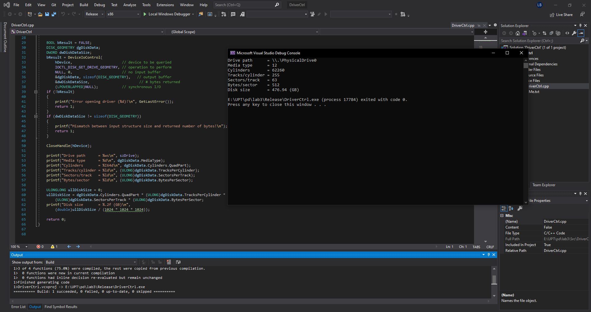
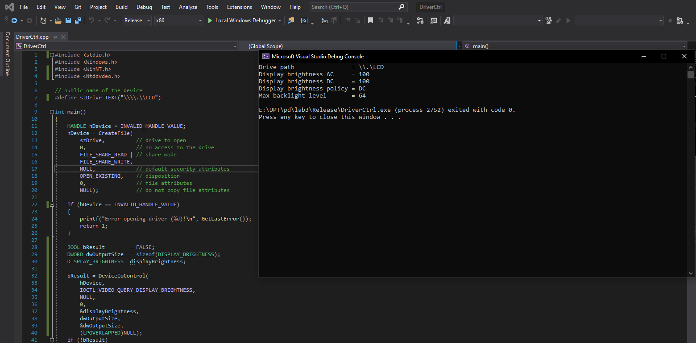

# Tema - laborator 3

## Detalii sistem
- *procesor*: *Intel I7-10750H*
- *memorie*: *16GB*
- *stocare*: *SSD de capacitate 512 GB*

## Rezultate rulare cod initial


## Rezultate aplicatie modificata



### IOCTL_VIDEO_QUERY_DISPLAY_BRIGHTNESS
Pentru a putea obtine informatii privind stralucirea display-ului si modul de rulare al acestuia, functia DeviceIOControl trebuie apelata in urmatorul mod:
```C
 result = DeviceIOControl(
  (HANDLE) hDevice,
  IOCTL_VIDEO_QUERY_DISPLAY_BRIGHTNESS,
  NULL,
  0,
  (LPVOID) lpOutBuffer,
  (DWORD) nOutBufferSize,
  (LPDWORD) lpBytesReturned,
  (LPOVERLAPPED) lpOverlapped
```
unde
- ```hDevice``` este handle-ul returnat de functia CreateFile pentru drive-ul ***\\.\LCD***
- ```IOCTL_VIDEO_QUERY_DISPLAY_BRIGHTNESS``` este function code-ul
- cel de-al treilea parametru(**NULL**) este bufferul de input
- cel de-al patrulea parametru(0) este size-ul in bytes al bufferului de input
- ```lpOutBuffer``` un pointer catre o structura de tip ```DISPLAY_BRIGHTNESS```
- ```nOutBufferSize``` numarul de bytes al bufferului de output(*DISPLAY_BRIGHTNESS*)
- ```lpBytesReturned``` numarul de bytes returnat de API

**DISPLAY_BRIGHTNESS**
```C
typedef struct _DISPLAY_BRIGHTNESS {
  UCHAR ucDisplayPolicy;
  UCHAR ucACBrightness;
  UCHAR ucDCBrightness;
} DISPLAY_BRIGHTNESS, *PDISPLAY_BRIGHTNESS;
```
```ucACBrightness``` = valoarea factorului de stralucire al ecranului in curent alternativ\
```ucDCBrightness``` = valoarea factorului de stralucire al ecranului in curent continuu\
```ucDisplayPolicy``` = modul de rulare

### IOCTL_VIDEO_QUERY_SUPPORTED_BRIGHTNESS
Pentru a obtine informatii despre nivelurile backlightului, functia DeviceIOControl trebuie apelata in felul urmator:
```C
BOOL result = DeviceIoControl(
    (HANDLE) hDevice,
    IOCTL_VIDEO_QUERY_SUPPORTED_BRIGHTNESS,
    NULL,
    0,
    (LPVOID) lpOutBuffer,
    (DWORD) nOutBufferSize,
    (LPDWORD) lpBytesReturned,
    (LPOVERLAPPED) lpOverlapped
);
```
unde
- ```hDevice``` este handle-ul returnat de functia CreateFile pentru drive-ul ***\\.\LCD***
- ```IOCTL_VIDEO_QUERY_SUPPORTED_BRIGHTNESS``` este function code-ul
- cel de-al treilea parametru(**NULL**) este bufferul de input
- cel de-al patrulea parametru(0) este size-ul in bytes al bufferului de input
- ```lpOutBuffer``` un pointer catre un buffer de 256 de bytes care va contine nivelurile de putere
- ```nOutBufferSize``` numarul de  bytes al bufferului de output(256)
- ```lpBytesReturned``` numarul de bytes returnat de API -> lpOutBuffer[lpBytesReturned - 1] == nivelul maxim

